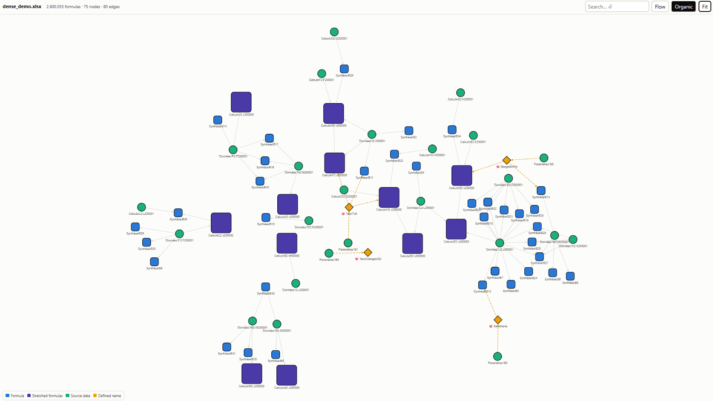
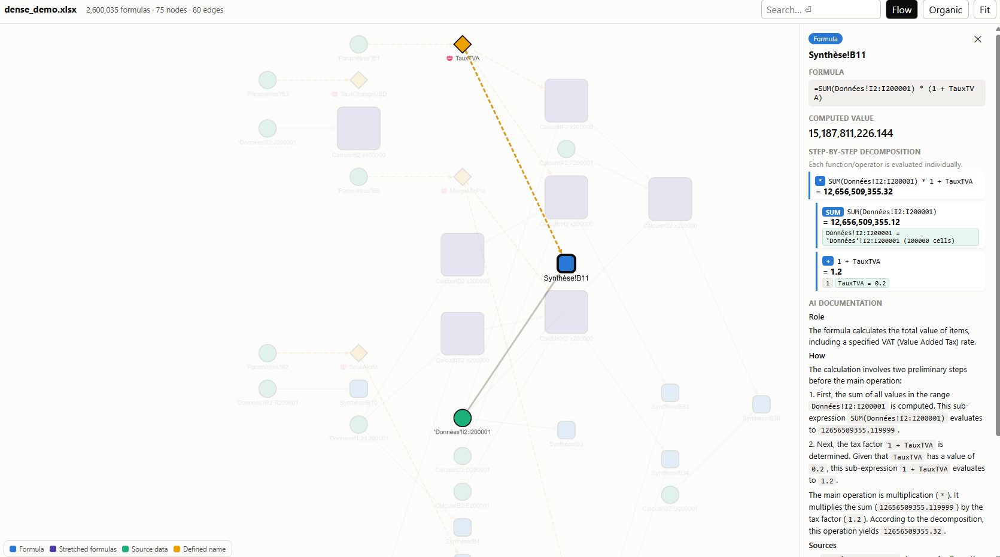
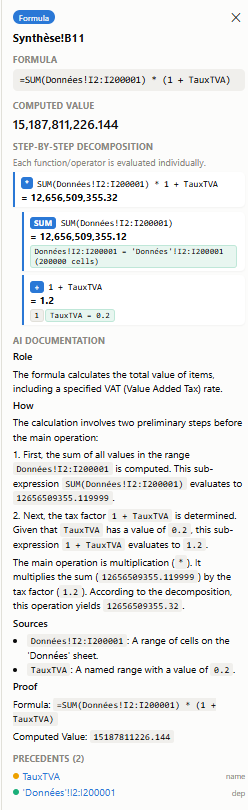

# linexcel

Data lineage analysis for Excel workbooks.

Extracts every formula, groups stretched patterns (R1C1 canonicalization), builds a dependency graph (cells, ranges, defined names, VBA), decomposes composite functions with step-by-step evaluation, and optionally documents calculations via AI.

## Install

```bash
pip install linexcel
# AI documentation (optional):
pip install "linexcel[ai]"
```

## Usage

```python
from linexcel import analyze

result = analyze("workbook.xlsx")
result                    # interactive graph in marimo / Jupyter
result.save_html("out.html")     # standalone offline HTML viewer
result.stats              # {totalFormulas, totalNodes, ...}
result.warnings           # list[str]

# AI documentation (optional, requires google-genai):
docs = result.document(api_key="...")        # all calculation nodes
docs = result.document(node_ids=["A1"], api_key="...")
result.save_html("out.html", docs=docs)      # docs embedded in HTML
```

## Features

- **Formula extraction** via [formualizer](https://pypi.org/project/formualizer/) (Rust engine)
- **Stretched pattern grouping** — 1000 identical formulas → 1 node
- **Dependency graph** — cells, ranges, defined names, VBA procedures
- **Step-by-step evaluation** — each operator/function evaluated individually
- **Standalone HTML viewer** — Cytoscape.js embedded, fully offline
- **AI documentation** — Gemini generates provable docs from deterministic lineage


## Sample output

### Global overview






### Sample doc

