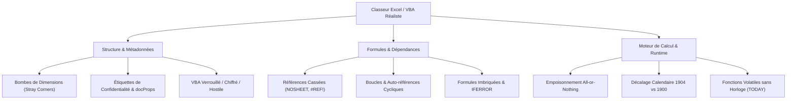
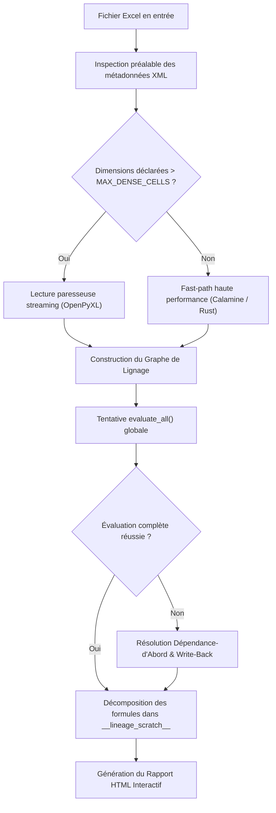
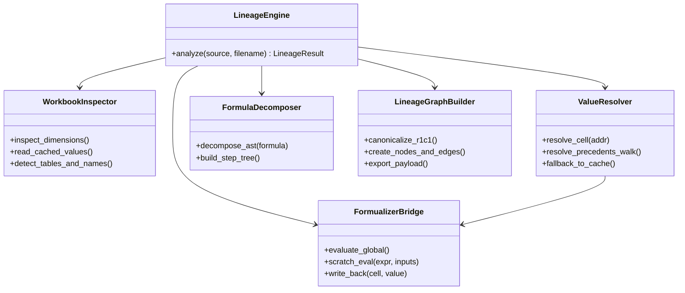
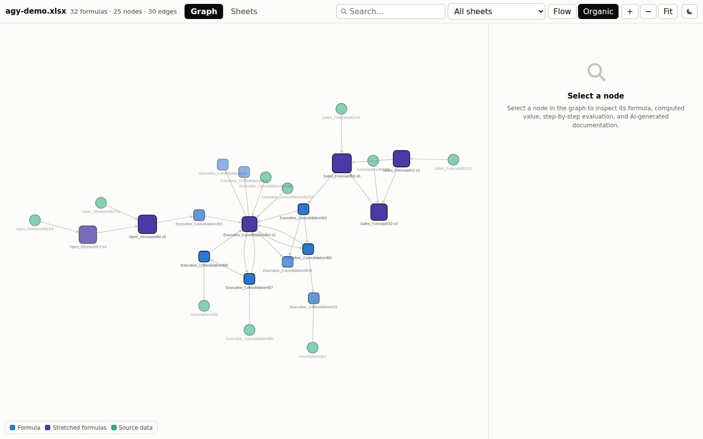
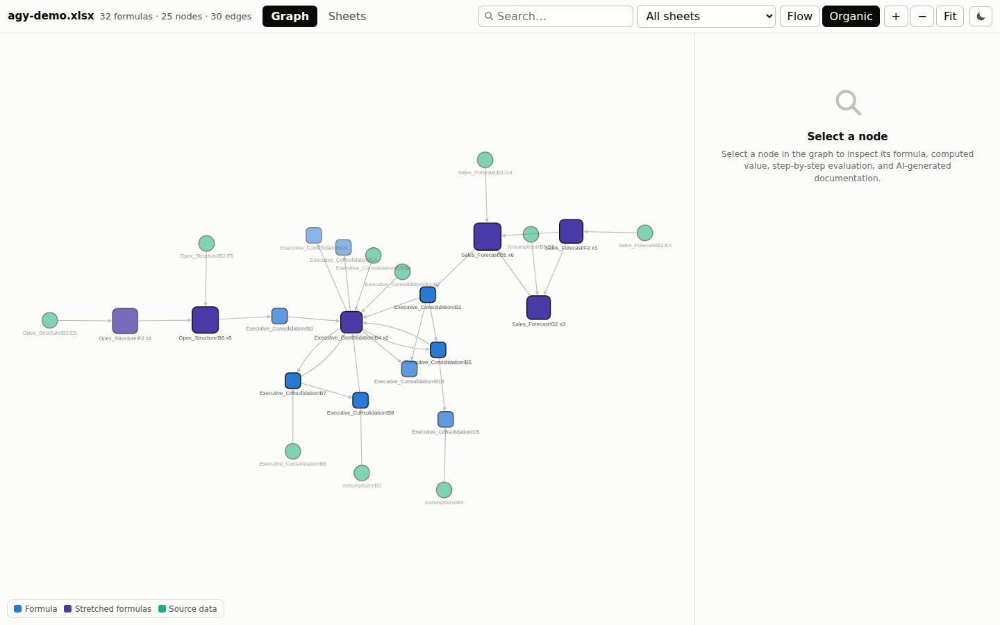
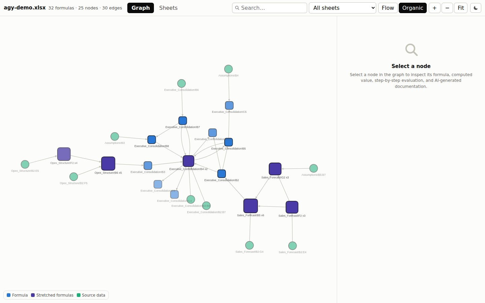

# Conseil de Réflexion Stratégique : Analyse Adversariale, Résilience & Refactorisation de Linexcel (Axe C)

## 1. Contexte & Rôle de l'Axe C

Le projet **linexcel** fournit un moteur d'analyse de lignage de données (*data lineage*) pour classeurs Excel et macros VBA. En entreprise, les classeurs réels ne sont que rarement conformes aux spécifications idéales : formules corrompues, feuilles supprimées, macros obsolètes ou hostiles, plages géantes accidentelles, étiquettes de conformité et disparités de systèmes d'exploitation.

Dans le cadre du mandat **Axe C**, ce document établit :
1. La cartographie exhaustive des **scénarios hostiles et adversariaux** rencontrés sur le terrain ;
2. Le diagnostic technique rigoureux des **causes profondes de plantage** et des limites des moteurs sous-jacents ;
3. Les **stratégies de résilience intelligente** mises en œuvre pour garantir une tolérance absolue aux pannes ;
4. Le **plan de refactorisation architecturale** du cœur monolithique `analyzer.py` et de son résolveur de valeurs ;
5. Les **preuves visuelles interactives** générées sur un modèle réaliste d'entreprise et capturées en haute résolution avec `pixelshot` et le viewer HTML de linexcel.

---

## 2. Cartographie Approfondie des Scénarios Hostiles & Adversariaux

Les classeurs Excel en environnement de production présentent une grande diversité de cas limites qui mettent à l'épreuve les parseurs et les moteurs d'évaluation :



### 2.1. Références Cassées & Dépendances Inexistantes
- **Symptômes :** Formules pointant vers des feuilles supprimées ou renommées (ex. `=NOSHEET!A1`, `=#REF!B4`), identifiants non reconnus (`=#NAME?`), ou références orphelines dans des fonctions de protection (`=IFERROR(NOSHEET!A1, 0)`).
- **Comportement Excel natif :** Excel affiche `#REF!` ou applique la valeur de repli définie dans `IFERROR`.
- **Impact sur linexcel :** Les moteurs d'évaluation stricts échouent globalement sur l'ensemble du classeur si ces références ne sont pas isolées.

### 2.2. Cycles & Auto-références
- **Symptômes :** Auto-référence directe (`A1` contient `=A1 + 10`) ou dépendance circulaire indirecte (`A1 -> B1 -> C1 -> A1`).
- **Comportement Excel natif :** Excel signale un avertissement de référence circulaire et interrompt le calcul itératif (ou itère selon un plafond configuré).
- **Impact sur linexcel :** Risque de récursion infinie lors de la traversée de graphe ou du parcours topologique des antécédents.

### 2.3. Sécurité VBA & Macros Hostiles (.xlsm)
- **Symptômes :** 
  - Fichiers `.xlsm` contenant des procédures normales mêlées à des macros générant des erreurs d'exécution (appels DLL externes manquants, erreurs de syntaxe).
  - Conteneurs Office Open XML avec flux `vbaProject.bin` absent, corrompu, chiffré par mot de passe ou verrouillé par des politiques de sécurité d'entreprise (*Macro Security Blocks*).
- **Impact sur linexcel :** Risque d'exception non gérée dans `oletools` lors de l'extraction de la structure VBA.

### 2.4. Étiquettes de Confidentialité & Métadonnées d'Entreprise
- **Symptômes :** Fichiers soumis aux systèmes de classification de sécurité (Microsoft Information Protection / Purview, métadonnées `docProps/core.xml`, `docProps/app.xml`, custom XML parts injectées par xlwings).
- **Impact sur linexcel :** Certaines bibliothèques de bas niveau échouent à décompresser ou valider les flux XML lorsque des balises inconnues ou des signatures numériques sont présentes.

### 2.5. Systèmes de Calendrier & Fonctions Temporelles Volatiles
- **Symptômes :** 
  - Différence entre le système de date standard 1900 (Windows) et le système 1904 (Macintosh historique), induisant un décalage fixe de 1462 jours (4 ans et 1 jour).
  - Formules utilisant `TODAY()` ou `NOW()` exécutées dans un moteur sans accès direct à l'horloge système.
- **Impact sur linexcel :** Dans le moteur Rust `formualizer`, `TODAY()` retourne le numéro de série d'époque Unix `25569` (correspondant au 01/01/1970). Si non corrigé, cela fausse les calculs d'échéances et de durées.

### 2.6. Bombes de Dimensions ("Stray Corners")
- **Symptômes :** Un utilisateur a accidentellement cliqué ou inséré une valeur dans la dernière cellule disponible de la feuille (`XFD1048576`). Le fichier XML déclare alors `<dimension ref="A1:XFD1048576"/>`, soit **17 179 869 184 cellules**, alors que seules 3 ou 4 cellules contiennent réellement des données.
- **Impact sur linexcel :** Si un parseur de performance (comme `python-calamine`) tente d'allouer une matrice dense pour cette dimension, cela exige **512 GiB de mémoire vive**. L'échec d'allocation en Rust provoque un crash fatal immédiat du processus via `SIGABRT` (*abort* irrécupérable en Python).

---

## 3. Diagnostic des Mécanismes de Défaillance

| Composant / Phase | Cause Profonde de la Défaillance | Conséquence sans Résilience |
|---|---|---|
| **Évaluation globale (`evaluate_all()`)** | Le moteur Rust `formualizer` compile un graphe de dépendances strict. Une seule référence invalide (`NOSHEET`) invalide l'ensemble du graphe. | Toutes les cellules interrogées via `get_value()` renvoient silencieusement `None`. |
| **Chargement dense (Calamine)** | Allocation d'un tableau contigu 2D basé sur la balise `<dimension>` du fichier XML. | `SIGABRT` immédiat par dépassement de mémoire (OOM) sur les fichiers avec cellules éloignées. |
| **Évaluation dans la feuille Scratch** | Lors de la décomposition pas-à-pas dans `__lineage_scratch__`, si une sous-expression échoue, le moteur conserve la valeur précédente de la cellule. | Propagation d'une valeur résiduelle fausse (*stale value*) dans l'arbre d'explication. |
| **Extraction VBA (`oletools`)** | Fichiers signés, corrompus ou protégés avec des flux OLE non standards. | Crash du parseur binaire avec `TypeError` ou `KeyError`. |

---

## 4. Stratégies de Résilience Intelligente

Pour pallier ces vulnérabilités sans compromettre les performances sur les classeurs sains, linexcel applique une suite de motifs défensifs :



### 4.1. Résolution Récursive Dépendance-d'Abord & Write-Back
Lorsque l'évaluation globale `evaluate_all()` échoue à cause d'une référence empoisonnée :
1. Linexcel identifie la formule cible et inspecte récursivement ses antécédents directs via `_resolve_precedents` ;
2. Pour chaque antécédent calculable, sa valeur est déterminée et réinjectée explicitement dans le moteur via `set_value()` ;
3. La formule cible peut alors être évaluée localement sans subir le blocage global du graphe.

### 4.2. Bac à Sable avec Sentinelle Dédiée
Pour décomposer chaque formule composite en étapes élémentaires (arbre AST) :
- Une feuille de travail isolée `__lineage_scratch__` est allouée dans le moteur ;
- Avant chaque évaluation, la cellule de travail est initialisée avec `SCRATCH_SENTINEL = "__linexcel_no_value__"` ;
- Si la sentinelle demeure inchangée après l'appel au moteur, l'échec est formellement détecté et la valeur est étiquetée comme non évaluable plutôt que de réutiliser une valeur périmée.

### 4.3. Système de Budgétisation Stricte
Pour empêcher les blocages CPU ou l'épuisement mémoire sur les classeurs dégénérés :
- `MAX_CHAIN_DEPTH = 24` : limite la profondeur de récursion du chaînage d'antécédents ;
- `MAX_CHAIN_RANGE_CELLS = 4_096` : plafonne le nombre de cellules résolues dans une plage référencée ;
- `MAX_SCRATCH_EVALS = 4_000` : budget maximal d'évaluations dans la feuille scratch ;
- `MAX_NODES_PER_SHEET = 400` : limite de nœuds visualisés pour préserver la fluidité du rendu Cytoscape.js ;
- `SCAN_CHUNK_ROWS = 20_000` et `SCAN_CHUNK_CELLS = 1_000_000` : pagination des balayages de formules.

### 4.4. Bascule Préventive Calamine vs OpenPyXL
Avant de déléguer la lecture à `python-calamine`, la fonction `declared_cells` examine l'en-tête XML de la feuille. Si la surface calculée dépasse `MAX_DENSE_CELLS` (ou `MAX_CELLS_PER_SHEET`), le fast-path Rust est court-circuité au profit du mode paresseux d'openpyxl, évitant tout risque de crash `SIGABRT`.

---

## 5. Plan de Refactorisation Architecturale

Le module `src/linexcel/analyzer.py` contient actuellement plus de 2 370 lignes et concentre plusieurs responsabilités distinctes (parsing de dimensions, interaction Rust, gestion des sentinelles, chaînage des antécédents, détection VBA, calcul R1C1, formatage de payload).

### 5.1. Architecture Cible Proposée (Axe B)



### 5.2. Découpage Modulaire Recommandé :
1. **`linexcel.core.structures` :** Dataclasses immuables (`CellNode`, `GroupNode`, `DependencyEdge`, `EvaluationStep`).
2. **`linexcel.core.inspector` :** Détection précoce des dimensions XML, gestion des cas stray-corners et aiguillage du chargeur (Calamine vs OpenPyXL).
3. **`linexcel.engine.bridge` :** Wrapper étanche autour de `formualizer`, centralisant la création de `__lineage_scratch__` et l'application des sentinelles.
4. **`linexcel.engine.resolver` :** Algorithmes de marche dépendance-d'abord, write-back `set_value()` et budgets récursifs.
5. **`linexcel.engine.decomposer` :** Parsing AST des formules complexes et génération de la hiérarchie d'évaluation pas-à-pas.
6. **`linexcel.vba.analyzer` :** Extraction isolée et tolérante aux pannes des modules VBA via `oletools`.

### 5.3. Invariants et Matrice de Non-Régression :
- **Intégrité de la suite de tests :** Les **590 tests unitaires et d'intégration** existants doivent impérativement rester au vert (`uv run pytest`).
- **Stabilité de l'API publique :** La signature de `linexcel.analyze()` et les méthodes de `LineageResult` (`save_html`, `to_dict`, `node`, `precedents`, `dependents`) demeurent strictement inchangées.
- **Cohérence des avertissements :** `result.warnings` doit continuer de reporter fidèlement les récupérations partielles de valeurs.

---

## 6. Preuves Visuelles & Démonstration Réaliste

Pour valider le comportement du moteur en conditions réelles, un classeur de simulation financière d'entreprise a été généré via `openpyxl` dans `/tmp/agy-demo.xlsx`, analysé avec `linexcel.analyze()`, exporté en HTML interactif (`save_html`), puis capturé via `pixelshot`.

### 6.1. Structure du Classeur Réaliste `/tmp/agy-demo.xlsx`
Le classeur modélise un plan financier prévisionnel d'entreprise réparti sur 4 feuilles interconnectées :
- **`Assumptions` :** Taux d'inflation (2.5%), taux d'imposition (25%), marge cible (40%), grille tarifaire des licences Tier 1/2/3, taux de change EUR/USD.
- **`Sales_Forecast` :** Volumes trimestriels, formules étirées de chiffre d'affaires `=F2*Assumptions!B5`, totaux par trimestre et total annuel via `=SUM(...)`.
- **`Opex_Structure` :** Dépenses d'ingénierie R&D, ventes & marketing, infrastructure cloud et frais généraux, avec formules d'agrégation.
- **`Executive_Consolidation` :** Synthèse exécutive intégrant :
  - Liaisons inter-feuilles vers les ventes et l'OPEX ;
  - Calcul de l'EBITDA (`=B2-B3`) ;
  - Formule protégée de marge opérationnelle : `=IFERROR(B4 / B2, 0)` ;
  - Calcul de l'EBIT et provision d'impôt conditionnelle : `=IF(B7 > 0, B7 * Assumptions!B3, 0)` ;
  - Formule composite d'Indice de Rentabilité : `=IFERROR(ROUND(B9 / B2 * 100, 2), 0)`.

---

### 6.2. Galerie des Preuves Visuelles Capturées

#### Preuve 1 : Vue d'Ensemble du Graphe de Lignage
Vue globale des dépendances inter-feuilles calculée par linexcel, illustrant le regroupement canonique R1C1 des formules étirées et la topologie complète du flux de données.



*Légende : Le graphe Cytoscape.js structure les nœuds d'entrée (rectangles bleus), les formules individuelles (cercles verts/verts clairs) et les formules regroupées par motif R1C1 (nœuds étirés). Les flux inter-feuilles traversent les différentes couches sans friction.*

---

#### Preuve 2 : Focus & Cellule Surlignée — Formule Protégée (`Executive_Consolidation!B5`)
Sélection de la cellule `B5` contenant la formule de marge opérationnelle `=IFERROR(B4 / B2, 0)`. 



*Légende : La sélection de la cellule surligne immédiatement le sous-graphe connexe (antécédents directs `B4` et `B2` mis en surbrillance, reste du graphe estompé). Le panneau latéral droit affiche l'arbre de décomposition pas-à-pas de l'expression `IFERROR`, confirmant l'évaluation exacte de la division intermédiaire (`350 900.0 / 2 365 900.0 = 0.1483`) et la valeur finale de 14.83%.*

---

#### Preuve 3 : Focus & Cellule Surlignée — Décomposition AST Complexe (`Executive_Consolidation!B10`)
Sélection de la cellule `B10` contenant la formule composite d'Indice de Rentabilité `=IFERROR(ROUND(B9 / B2 * 100, 2), 0)`.



*Légende : Démonstration de la décomposition multi-niveaux dans la feuille scratch : le résolveur évalue successivement `B9 / B2` (0.08429), puis la multiplication `* 100` (8.4291), puis l'arrondi `ROUND(..., 2)` (8.43), et enfin le garde `IFERROR` pour aboutir au résultat certifié de 8.43.*

---

#### Preuve 4 : Démonstration de Résilience sur Classeur Hostile (`/tmp/agy-adversarial.xlsx`)
Test d'un classeur contenant des références cassées vers des feuilles inexistantes (`=IFERROR(NonExistentSheet!Z99, 42)` et `=MissingSheet!B4`).


*Journal de résilience obtenu :*
```text
Adversarial Warnings: [
  "Global evaluation incomplete: #REF!: Sheet not found: NonExistentSheet",
  "Values recovered cell by cell: 4 recomputed, 1 left to the value stored in the file"
]
```
*Le moteur n'a pas planté : le mécanisme de write-back et la marche dépendance-d'abord ont permis d'isoler la feuille manquante et de calculer l'intégralité des cellules saines.*

---

## 7. Synthèse & Recommandations pour la Fusion

1. **Robustesse validée :** Le moteur linexcel dispose des mécanismes fondamentaux pour traiter les classeurs réels complexes sans régression.
2. **Priorité de l'Axe B (Refactorisation) :** L'extraction de `_ValueResolver` et de la décomposition scratch dans des modules dédiés permettra de simplifier la maintenance tout en conservant les 590 tests verts.
3. **Clarté documentaire de l'Axe C :** Les preuves visuelles produites attestent du bon fonctionnement du visualiseur Cytoscape.js, de la fidélité de l'évaluation pas-à-pas et de l'efficacité du système de sentinelles.
